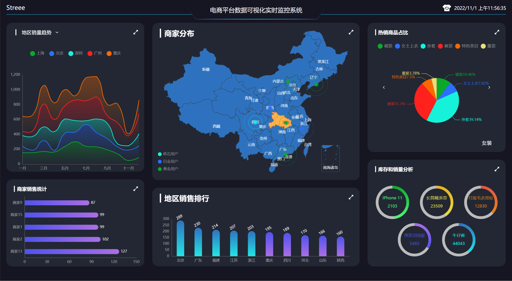
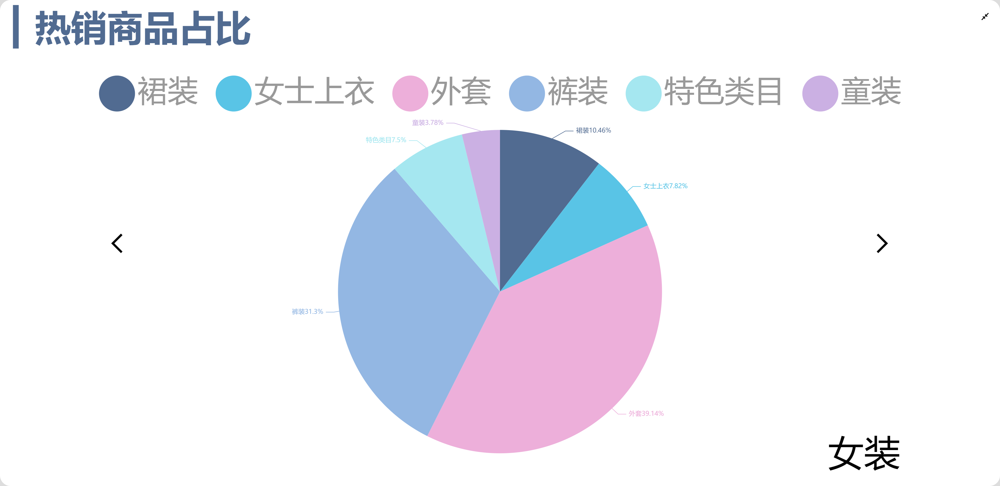
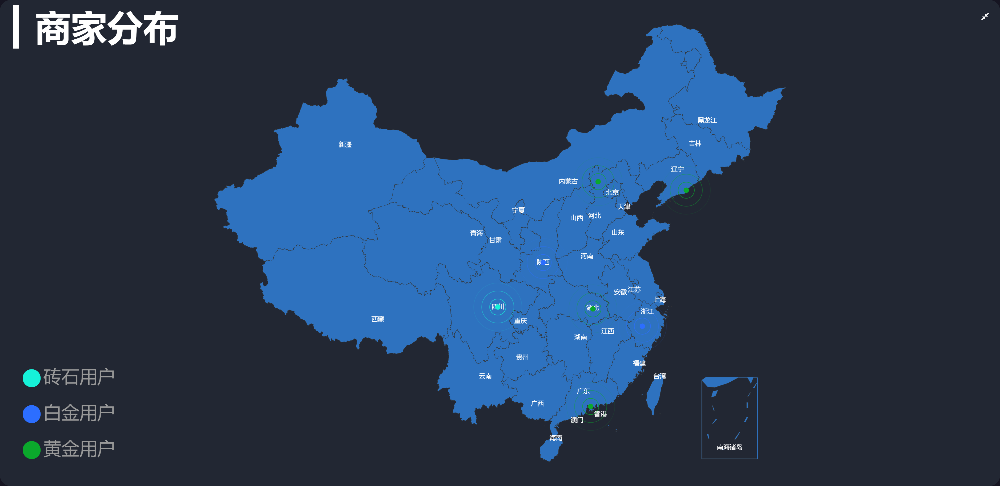
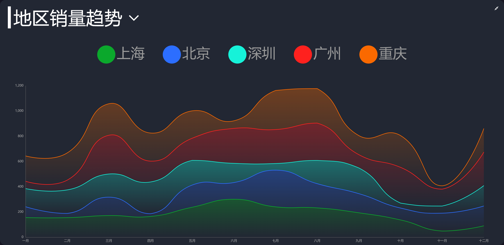

### 电商平台数据可视化实时监控系统

### 介绍
该项目为电商平台数据可视化实时监控系统，可以保证实时获取数据进行分析，支持大屏展示，自适应分辨率。

### 项目前端地址(当前)：[点击前往](https://github.com/Streeezsj/E-commerce-data-visualization)

### 后端地址：[点击前往](https://github.com/Streeezsj/koa_server)

### 安装运行
* #### 第一步
    * 克隆项目到本地`git clone https://github.com/Streeezsj/E-commerce-data-visualization.git
* #### 第二步
    * `cd data-view`进入该项目 
* #### 第三步
    * `cnpm install`安装依赖
* #### 第四步
    * 访问后台系统 `npm run serve`

### 技术栈
该项目主要使用 `Vue`搭配`Echarts`采用组件化的方式开发完成,此外项目中陆续使用有

- VueRouter
- VueX
- WebSocket
- axios
- webpack
- ES6+
- less

### 运行效果截图

#### 2.1 黑色主题

#### 2.2 亮色主题

#### 2.3 热销商品占比

#### 2.4 商家分布

#### 2.5 地区销售排行

#### 2.6 商家销售统计

#### 2.7 库存和销量分析

#### 2.8 地区销量趋势

### 留言

**可以的话可以在此留下阁下宝贵的建议**

-------------------------------------

### 作者信息

####  **[github](https://github.com/Streeezsj)**

联系邮箱: 506106022@qq.com

