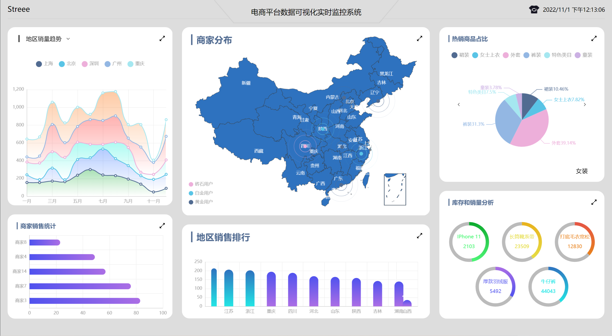
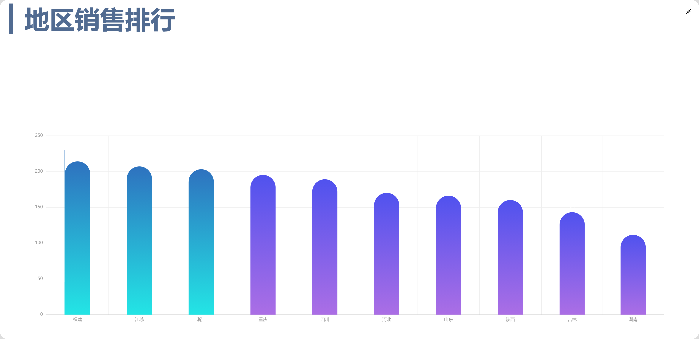
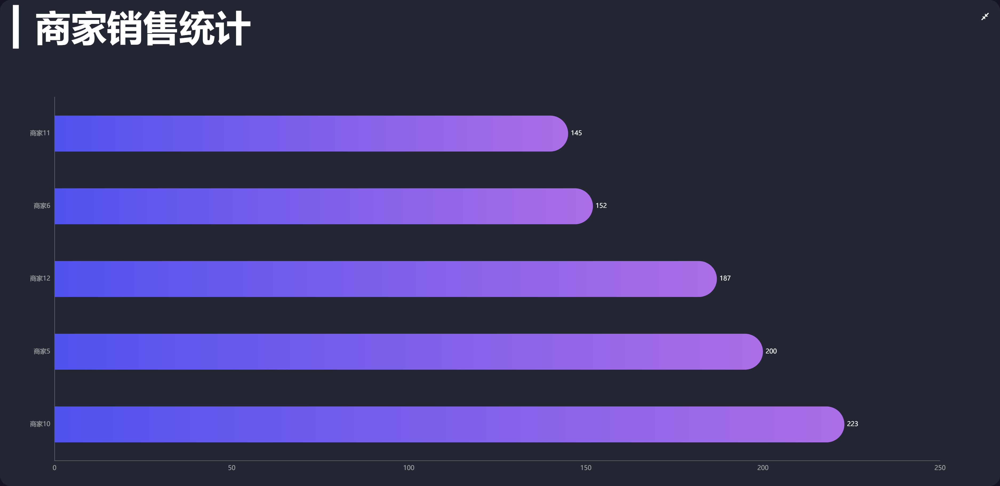
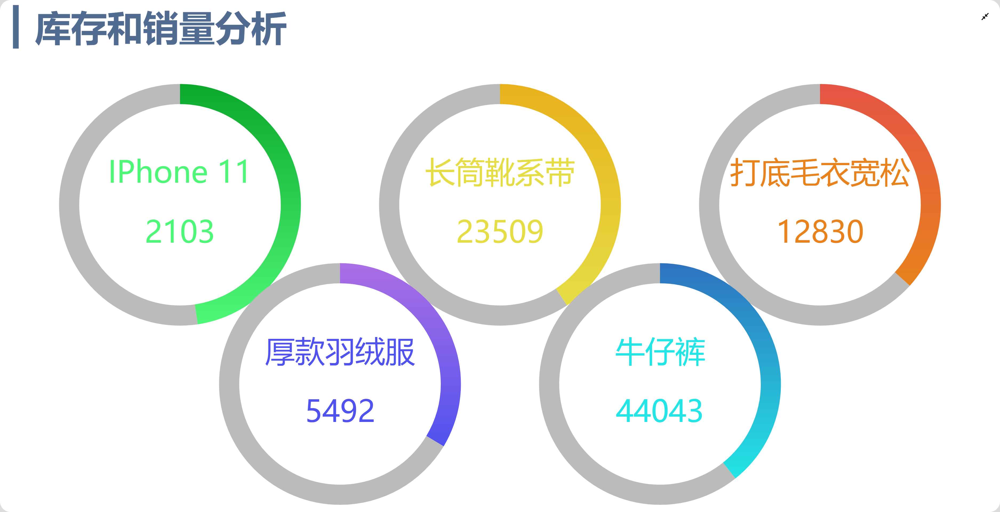

## 电商平台实时监控系统

## 预览地址: [点击预览](https://www.bookbook.cc/vue2/data-view)

## 项目前端地址(当前)：[点击前往](https://gitee.com/penggang-home/data-view)

## 后端地址：[点击前往](https://gitee.com/penggang-home/koa_server)

## 说明

如果你觉得本项目对你有帮助的话，请点个 Star 支持一下 🐷(一个赞都没有，太可怜了)

在学习该项目的过程中,如果你遇到任何问题都可以联系我,文末有联系方法。

[www.bookbook.cc](https://www.bookbook.cc/) 这是我的个人主页,你也可以在上面找到我的联系方式

## 一、技术栈

该项目主要使用 `Vue`搭配`Echarts`采用组件化的方式开发完成,此外项目中陆续使用有

- VueRouter
- VueX
- WebSocket
- axios
- webpack
- ES6+
- less

## 二、如何运行该项目？

```js
// 首先你应当克隆该项目
git clone https://gitee.com/penggang-home/data-view.git

// 进入该项目
cd data-view

// 安装对应依赖
cnpm install

// 访问线上后台系统
npm run serve
```

## 三、运行效果截图

#### 2.1 黑色主题


#### 2.2 亮色主题



#### 2.3 热销商品占比


#### 2.4 商家分布


#### 2.5 地区销售排行



#### 2.6 商家销售统计



#### 2.7 库存和销量分析



#### 2.8 地区销量趋势


## 四、 联系我

最后，如果你有什么奇怪的想法或者疑惑你都可以联系我，希望我能帮助到你。

- WX：P200048

- QQ：2845486124

- E-Mail：2845486124@qq.com

| QQ                  | WeChat              |
| ------------------- | ------------------- |
|  |  |
